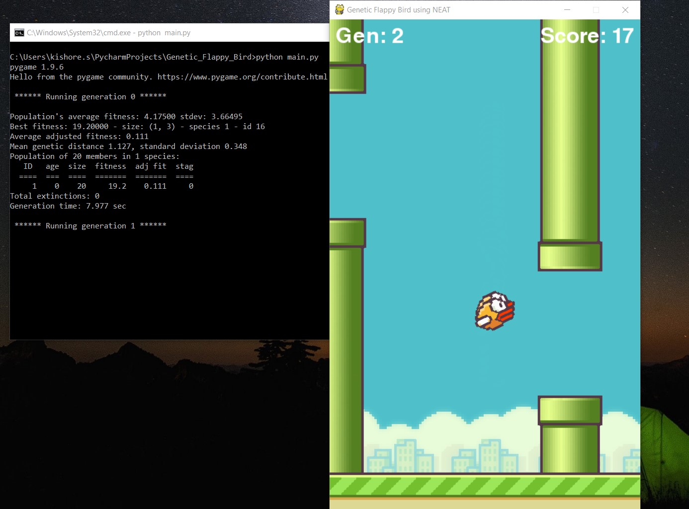

# Genetic-Flappy-Bird
> Genetic Flappy Bird is developed using Pygame. It implements the NEAT Genetic Algorithm for playing the Flappy Bird game.

## Demo


## Project Directory Structure

```
  ├── Genetic-Flappy-Bird                   # Root Folder
    ├── imgs/                               # Folder which contains game assets, demo image
    ├── .gitignore                          # .gitignore file
    ├── base.py                             # Python file which contains base (ground) class
    ├── bird.py                             # Python file which contains bird class
    ├── config.txt                          # Config file used for NEAT Algorithm
    ├── main.py                             # Main File of the project
    ├── pipe.py                             # Python file which contains pipe class
```

## Installation

1. Clone the repository into a folder
```
$ git clone https://github.com/kishore-s-15/Vehicle-Crashes-NYC.git
```
2. Install the dependencies
```
pip install pygame (and) pip install neat-python
```
3. Then run the following command from inside the project directory
```
python main.py (or) python3 main.py
```
